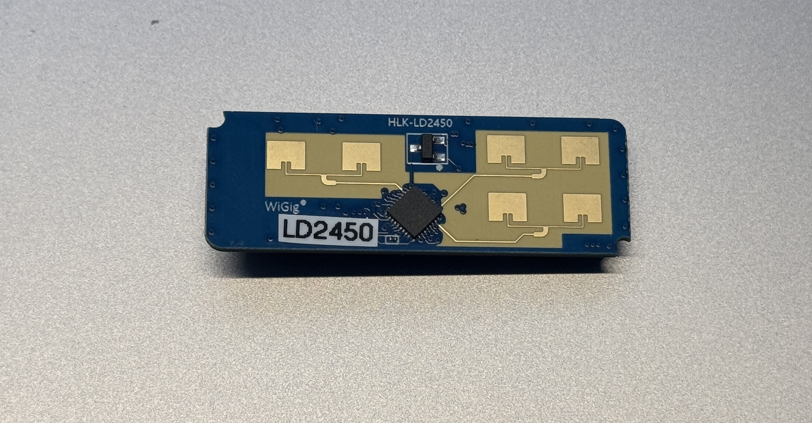

## LD2450 24Ghz Human Radar

Arduino library for `HLK-LD2450 24Ghz Human body Motion Inductive Radar Sensor Module Kit`

An Arduino library for the `Hi-Link HLK-LD2450 24Ghz FMCW radar sensor`. This sensor is a Frequency Modulated Continuous Wave radar, which makes it good for presence detection and has some interesting new features, including precise target location of three objects at the same time.

## HARDWARE REQUIREMENTS

The `LD2450`, as sold for configuration with the common breakout boards shown above communicates over serial at `256000` baud by default. This library allows you to configure and use the sensor over this serial connection. As the `LD2450` is a device that uses a high baud rate, a microcontroller with a spare hardware UART for this communication is preferable to bit-banged software serial.

In the current sensors firmware state (at least on my board), the `LD2450` always returns three targets. The current implementation extracts the `valid` flag by using the `resolution` field. If `resolution` is set to an value except than `0`, the target is marked as`valid` and detected. For more information about this specific implementation, please refer to `ProcessSerialDataIntoRadarData` function.

### EXAMPLE CODE

1、Windows cmd窗口：
1.1、cd Documents\Arduino\libraries
1.2、git clone https://gitee.com/wangshunda/hlk-ld2450.git

2、打开Arduino IDE
2.1、范例：HLK-2450\withconfig
编译、上传
2.2、范例：HLK-2450\withoutconfig
编译、上传

## DISCLAIMER AND NOTES

The library is based on the following projects:

* https://github.com/arduino/Arduino/wiki/Library-Manager-FAQ
* https://github.com/0ingchun/arduino-lib_HLK-LD2450_Radar/
* https://github.com/RBEGamer/HLK-LD2450
